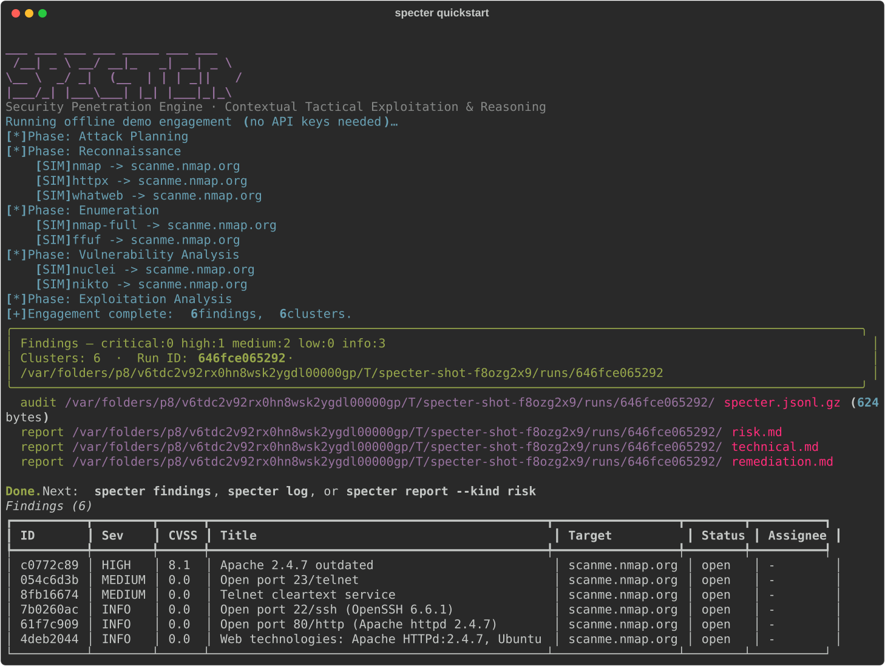

<div align="center">

# 👻 Specter **AI**

### AI-driven automated penetration testing, from your terminal

**S**ecurity **P**enetration **E**ngine · **C**ontextual **T**actical **E**xploitation & **R**easoning

[](LICENSE)
[](https://www.python.org/)
[](https://github.com/sam00/AI-Specter/actions/workflows/ci.yml)
[](tests/)
[](CONTRIBUTING.md)

</div>

Specter AI plugs your **Claude, GPT, local Ollama, or _any_ LLM** into a real
pentest workflow and **routes each phase of an engagement to the model best
suited for it** — a deep reasoner for exploit chains, a cheap/fast model for
parsing, a local model for sensitive data. It runs scope‑guarded security
tools, triages their output with AI, and writes you three reports.

> ⚠️ **Authorized use only.** Specter enforces a scope allowlist and gates every
> active/exploitation action behind explicit flags. Only test systems you are
> contractually authorized to assess.

<p align="center">
  
</p>

---

## Why use this?

- **The problem it solves.** A pentest is a dozen tools and a mountain of noisy
  output. One LLM is either too expensive for parsing or too weak for exploit
  reasoning. Specter AI orchestrates the tools **and** picks the right model per
  task, so you get higher‑signal findings at lower cost — with an audit trail.

- **60‑second quickstart** (no API key, no installed tools required):

  ```bash
  pipx install ai-specter        # or: pip install ai-specter
  specter quickstart             # runs a full engagement on bundled demo data
  ```

  That's it — you'll see live findings, correlated clusters, an audit log, and
  three generated reports. Then point it at a real (authorized) target.

- **Screenshot.** See the run above — actual offline output rendered to
  [`docs/assets/specter-demo.svg`](docs/assets/specter-demo.svg) (regenerate any
  time with `python scripts/capture_screenshot.py`).

- **Example output.**

  ```text
  Findings — critical:0 high:1 medium:2 low:0 info:3
  Clusters: 6  ·  Run ID: 25de028a1a49

  ┃ Sev    ┃ CVSS ┃ Title                            ┃ Target          ┃ Status ┃
  ┡━━━━━━━━╇━━━━━━╇━━━━━━━━━━━━━━━━━━━━━━━━━━━━━━━━━━━╇━━━━━━━━━━━━━━━━━╇━━━━━━━━┩
  │ HIGH   │ 8.1  │ Apache 2.4.7 outdated (CVE-…)    │ scanme.nmap.org │ open   │
  │ MEDIUM │  -   │ Open port 23/telnet              │ scanme.nmap.org │ open   │
  ```

  Plus full Markdown reports: see [`docs/example-report.md`](docs/example-report.md).

- **Who it is for.** Pentesters, red teamers, and security engineers who live in
  the terminal and want AI leverage without vendor lock‑in or sending sensitive
  scope data to a model they didn't choose.

- **What it is _not_.** Not a point‑and‑click autopwn. Not a replacement for a
  skilled operator's judgment. Not a way to attack systems you don't own —
  scope is enforced and exploitation is opt‑in.

---

## Highlights

- **🧠 Per‑task model advisor** — optimal model for *each* sub‑task; mix
  providers in a single engagement. `specter advisor` shows the routing.
- **🤖 Two engines** — a deterministic **pipeline** (plan → recon → enum → vuln →
  exploit) and an autonomous **agent** loop (`specter run --agent`) that decides
  its own next action.
- **⚡ Fast & resilient** — parallel tool execution, response **caching**, retry
  with backoff, dynamic token sizing, and a per‑engagement **cost/token budget**.
- **🔎 Native parsers + AI triage** — nmap/nuclei/httpx output is parsed
  deterministically, then enriched by an LLM; findings are **deduplicated,
  correlated into clusters, and second‑opinion verified**.
- **🛡️ Prompt‑injection defense** — untrusted tool output is sandboxed before it
  ever reaches a model.
- **📊 End‑to‑end reporting** — **risk** (exec), **technical** (engineer), and
  **remediation** reports out of the box.
- **👥 Team mode** — a shared SQLite store with finding workflow
  (`specter findings` / `specter triage`), an optional **API server**
  (`specter serve`), and an **MCP server** (`specter mcp`) for Claude/Cursor.
- **🎯 C2 integrations** — adapters for **Sliver**, **Cobalt Strike**, **Mythic**,
  and a **generic REST adapter** for any C2.
- **🔌 Bring your own model** — Claude, GPT, Ollama, or any OpenAI‑compatible
  endpoint. Run **fully offline** with a built‑in echo model + simulated tools.

## Install

```bash
git clone git@github.com:sam00/AI-Specter.git
cd AI-Specter
python -m venv .venv && source .venv/bin/activate
pip install -e .            # core
pip install -e '.[all]'     # + Claude, OpenAI, server, and MCP extras
```

Set whichever key you have (or skip and run offline):

```bash
export ANTHROPIC_API_KEY=...     # Claude
export OPENAI_API_KEY=...        # GPT
# or run fully local with Ollama — no key needed
```

## Usage

```bash
specter quickstart            # zero-config offline demo (great first run)
specter init                  # setup wizard (providers + scope + C2)
specter doctor --fix          # verify providers/tools/C2; scaffold config
specter advisor               # show which model handles each task
specter models                # list the model catalog (add --discover to probe)

specter run --name acme-q3                 # pipeline engagement (authorized scope)
specter run --agent --objectives "find RCE" # autonomous agent mode
specter report --kind risk                 # (re)generate a report from the latest run

specter findings                           # team view of all findings
specter triage <id> --status confirmed --assignee you
```

No keys yet? Everything above runs end‑to‑end with `--offline` using a built‑in
echo model and **simulated** tool output, so you can rehearse safely.

## Documentation

Full docs (what / why / how) are published with **GitHub Pages** from
[`docs/`](docs/) → **https://sam00.github.io/AI-Specter/**.

## Architecture

```
specter/
  advisor/     per-task model selection (the brain)
  llm/         provider-agnostic clients + resilient wrapper (Claude, GPT, Ollama)
  engine/      orchestrator, agent loop, phases, parsers→findings, memory
  tools/       scope-guarded security tool wrappers + native output parsers
  c2/          Sliver, Cobalt Strike, Mythic, generic adapters
  reporting/   risk / technical / remediation builders
  store.py     shared SQLite store (team workflow)
  server.py    optional FastAPI server (RBAC)   ·  mcp_server.py  optional MCP
  cli.py       Typer + Rich terminal UI
```

## Safety model

- Scope **allowlist** is checked before every active tool/C2 action.
- Exploitation and C2 tasking require `allow_exploitation: true`.
- `--offline` / dry‑run produces clearly‑labeled `[SIMULATED]` output.
- Untrusted tool output is wrapped against prompt injection before triage.
- Authorization metadata (`authorized_by`, `authorization_ref`) is recorded, and
  every action is written to a tamper‑evident JSONL audit log.

## Contributing

Issues and PRs are welcome — see [`CONTRIBUTING.md`](CONTRIBUTING.md) and our
[Code of Conduct](CODE_OF_CONDUCT.md). To report a vulnerability, see
[`SECURITY.md`](SECURITY.md).

## License

Apache‑2.0 © 2026 Sam Gupta — see [`LICENSE`](LICENSE) and [`NOTICE`](NOTICE).
