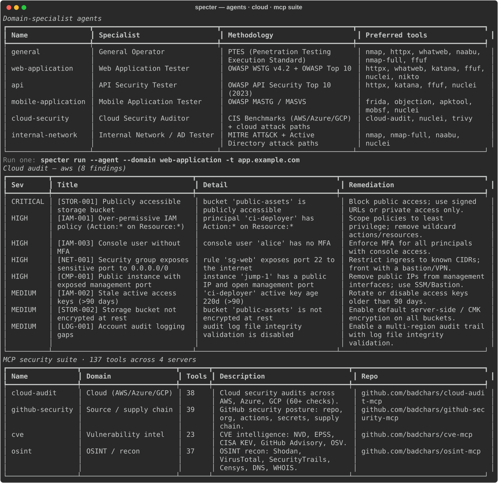

<div align="center">

# 👻 Specter **AI**

### AI-driven automated penetration testing, from your terminal

**S**ecurity **P**enetration **E**ngine · **C**ontextual **T**actical **E**xploitation & **R**easoning

[](LICENSE)
[](https://www.python.org/)
[](https://github.com/sam00/AI-Specter/actions/workflows/ci.yml)
[](tests/)
[](CONTRIBUTING.md)

</div>

Specter AI plugs your **Claude, GPT, local Ollama, or _any_ LLM** into a real
pentest workflow and **routes each phase of an engagement to the model best
suited for it** — a deep reasoner for exploit chains, a cheap/fast model for
parsing, a local model for sensitive data. It runs scope‑guarded security
tools, triages their output with AI, and writes you three reports.

Beyond recon, Specter ships **domain‑specialist agents** (web/API/mobile/cloud/
internal‑network), **evidence‑gated active web testing** (IDOR, authz, mass
assignment, injection, SSRF…), **cloud** (CIS) and **mobile** (MASVS) auditing,
**Relay** for signed remote tool execution, an **MCP server + ecosystem**, a
**web dashboard** and **TUI** — all behind the same scope guard and audit log.
See the **[full feature list](docs/FEATURES.md)**.

> ⚠️ **Authorized use only.** Specter enforces a scope allowlist and gates every
> active/exploitation action behind explicit flags. Only test systems you are
> contractually authorized to assess.

<p align="center">
  
</p>

---

## Why use this?

- **The problem it solves.** A pentest is a dozen tools and a mountain of noisy
  output. One LLM is either too expensive for parsing or too weak for exploit
  reasoning. Specter AI orchestrates the tools **and** picks the right model per
  task, so you get higher‑signal findings at lower cost — with an audit trail.

- **60‑second quickstart** (no API key, no installed tools required):

  ```bash
  pipx install ai-specter        # or: pip install ai-specter
  specter quickstart             # runs a full engagement on bundled demo data
  ```

  That's it — you'll see live findings, correlated clusters, an audit log, and
  three generated reports. Then point it at a real (authorized) target.

- **Screenshot.** See the run above — actual offline output rendered to
  [`docs/assets/specter-demo.svg`](docs/assets/specter-demo.svg) (regenerate any
  time with `python scripts/capture_screenshot.py`). The specialist agents,
  cloud audit, and MCP suite render below:

  <p align="center">
    
  </p>

- **Example output.**

  ```text
  Findings — critical:0 high:1 medium:2 low:0 info:3
  Clusters: 6  ·  Run ID: 25de028a1a49

  ┃ Sev    ┃ CVSS ┃ Title                            ┃ Target          ┃ Status ┃
  ┡━━━━━━━━╇━━━━━━╇━━━━━━━━━━━━━━━━━━━━━━━━━━━━━━━━━━━╇━━━━━━━━━━━━━━━━━╇━━━━━━━━┩
  │ HIGH   │ 8.1  │ Apache 2.4.7 outdated (CVE-…)    │ scanme.nmap.org │ open   │
  │ MEDIUM │  -   │ Open port 23/telnet              │ scanme.nmap.org │ open   │
  ```

  Plus full Markdown reports: see [`docs/example-report.md`](docs/example-report.md).

- **Who it is for.** Pentesters, red teamers, and security engineers who live in
  the terminal and want AI leverage without vendor lock‑in or sending sensitive
  scope data to a model they didn't choose.

- **What it is _not_.** Not a point‑and‑click autopwn. Not a replacement for a
  skilled operator's judgment. Not a way to attack systems you don't own —
  scope is enforced and exploitation is opt‑in.

---

## Highlights

- **🧠 Per‑task model advisor** — optimal model for *each* sub‑task; mix
  providers in a single engagement. `specter advisor` shows the routing.
- **🤖 Two engines** — a deterministic **pipeline** (plan → recon → enum → vuln →
  exploit) and an autonomous **agent** loop (`specter run --agent`) that decides
  its own next action.
- **⚡ Fast & resilient** — parallel tool execution, response **caching**, retry
  with backoff, dynamic token sizing, and a per‑engagement **cost/token budget**.
- **🔎 Native parsers + AI triage** — nmap/nuclei/httpx output is parsed
  deterministically, then enriched by an LLM; findings are **deduplicated,
  correlated into clusters, and second‑opinion verified**.
- **🛡️ Prompt‑injection defense** — untrusted tool output is sandboxed before it
  ever reaches a model.
- **🎯 Domain‑specialist agents** — web (WSTG), API (OWASP API Top 10), mobile
  (MASTG/MASVS), cloud (CIS), and internal‑network (ATT&CK) profiles steer the
  agent's methodology and tools. `specter agents`.
- **�️ Active web testing** — eight **evidence‑gated** sub‑testers (IDOR/BOLA,
  authz bypass, mass assignment, injection, broken auth, business logic, SSRF,
  path traversal) confirmed by a **baseline→attack→control→reproduce** protocol
  that kills one‑shot false positives. Fed by a HAR import or recording proxy
  with identity/role discovery. `specter webtest`, `specter proxy`.
- **☁️ Cloud & 📱 mobile audits** — CIS‑aligned AWS/Azure/GCP posture checks
  (`specter cloud`) and MASVS mobile checks (`specter mobile`).
- **🛰️ Relay** — Ed25519‑signed remote tool execution with client allowlisting,
  anti‑replay, scope guard, and horizontal fan‑out. `specter relay`.
- **� End‑to‑end reporting** — **risk** (exec), **technical** (engineer), and
  **remediation** reports, exportable to **Markdown, PDF, and Word** (`--format`).
- **👥 Team mode** — a shared SQLite store with finding workflow
  (`specter findings` / `specter triage`), an optional **API server**
  (`specter serve`), a **web dashboard** (`specter web`), and an interactive
  **TUI** (`specter tui`).
- **🔗 MCP server + ecosystem** — run Specter as an MCP server (`specter mcp`)
  *and* orchestrate external security MCP servers (`specter mcp-suite`).
- **🔔 Integrations** — Slack notifications (`specter slack`), Cloudflare Tunnel
  for zero‑open‑port remote access (`specter tunnel`), and localization
  (`specter lang`, 6 languages).
- **🎯 C2 integrations** — adapters for **Sliver**, **Cobalt Strike**, **Mythic**,
  and a **generic REST adapter** for any C2.
- **🔌 Use ANY model** — Claude, GPT, Ollama, or **any OpenAI‑compatible
  endpoint** (Groq, Together, OpenRouter, vLLM, LM Studio, LiteLLM…). Force one
  with `--model provider:model`, or run **fully offline** with a built‑in echo
  model + simulated tools.

## Install

```bash
git clone git@github.com:sam00/AI-Specter.git
cd AI-Specter
python -m venv .venv && source .venv/bin/activate
pip install -e .            # core
pip install -e '.[all]'     # everything: Claude, OpenAI, server, MCP, PDF + Word
# or pick extras: '.[claude]'  '.[openai]'  '.[reports]' (PDF/Word)  '.[server]'  '.[mcp]'
```

Set whichever key you have (or skip and run offline):

```bash
export ANTHROPIC_API_KEY=...     # Claude
export OPENAI_API_KEY=...        # GPT
export SPECTER_LLM_BASE_URL=...  # ANY OpenAI-compatible endpoint (+ _API_KEY / _MODEL)
# or run fully local with Ollama — no key needed
```

## Usage

```bash
specter quickstart            # zero-config offline demo (great first run)
specter init                  # setup wizard (providers + scope + C2)
specter doctor --fix          # verify providers/tools/C2; scaffold config
specter advisor               # show which model handles each task
specter models                # list the model catalog (add --discover to probe)

specter run --name acme-q3                 # pipeline engagement (authorized scope)
specter run --agent --objectives "find RCE" # autonomous agent mode
specter run -t acme.example --format all    # reports in Markdown + PDF + Word
specter run -t acme.example --model openai-compatible:llama-3.1-70b  # force any model
specter report --kind risk --format pdf    # (re)generate a report (md|pdf|docx|all)

specter agents                             # list domain-specialist agents
specter run --agent --domain web-application -t app.example.com  # specialist run
specter webtest --har session.har -t app.example.com  # evidence-gated web testing
specter proxy -t app.example.com           # recording proxy → live session context
specter cloud --provider aws --demo        # CIS cloud posture audit
specter mobile --apk app.apk               # MASVS mobile audit

specter findings                           # team view of all findings
specter triage <id> --status confirmed --assignee you
specter web                                # server + browser dashboard
specter tui                                # interactive terminal UI

specter relay keygen                       # Ed25519 identity for remote execution
specter mcp-suite list                     # external security MCP servers
```

No keys yet? Everything above runs end‑to‑end with `--offline` using a built‑in
echo model and **simulated** tool output, so you can rehearse safely.

## Documentation

Full docs (what / why / how) are published with **GitHub Pages** from
[`docs/`](docs/) → **https://sam00.github.io/AI-Specter/**.

## Architecture

```
specter/
  advisor/     per-task model selection (the brain)
  llm/         provider-agnostic clients (Claude, GPT, Azure, Bedrock, Mistral, Ollama, vLLM…)
  engine/      orchestrator, agent loop, phases, parsers→findings, memory
  agents/      domain-specialist profiles (web/api/mobile/cloud/internal-network)
  webtest/     evidence-gated active web testers + recording proxy / HAR capture
  cloud/       CIS-aligned cloud posture auditor (AWS/Azure/GCP)
  mobile/      MASVS mobile auditor + APK fact extraction
  relay/       Ed25519-signed remote tool execution (server + client)
  tools/       scope-guarded security tool wrappers + native output parsers
  c2/          Sliver, Cobalt Strike, Mythic, generic adapters
  integrations/ Slack   ·  remote/  Cloudflare Tunnel   ·  i18n/  localization
  reporting/   risk / technical / remediation builders (md/pdf/docx)
  store.py     shared SQLite store (team workflow)
  server.py    FastAPI server + web dashboard   ·  tui.py  Textual TUI
  mcp_server.py  MCP server   ·  mcp_catalog.py  external MCP ecosystem
  cli.py       Typer + Rich terminal UI
```

## Safety model

- Scope **allowlist** is checked before every active tool/C2 action.
- Exploitation and C2 tasking require `allow_exploitation: true`.
- `--offline` / dry‑run produces clearly‑labeled `[SIMULATED]` output.
- Untrusted tool output is wrapped against prompt injection before triage.
- Authorization metadata (`authorized_by`, `authorization_ref`) is recorded, and
  every action is written to a tamper‑evident JSONL audit log.

## Contributing

Issues and PRs are welcome — see [`CONTRIBUTING.md`](CONTRIBUTING.md) and our
[Code of Conduct](CODE_OF_CONDUCT.md). To report a vulnerability, see
[`SECURITY.md`](SECURITY.md).

## License

Apache‑2.0 © 2026 Sam Gupta — see [`LICENSE`](LICENSE) and [`NOTICE`](NOTICE).
